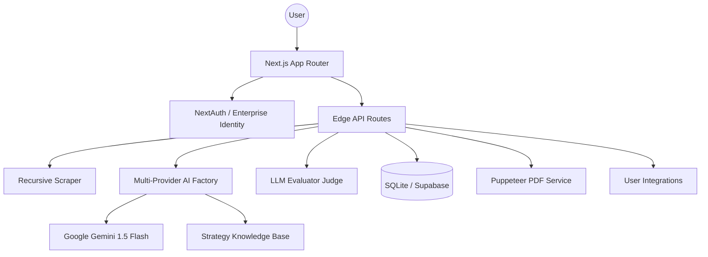

# Specvla Ergon — Avditor Mvndi ✦

[](https://github.com/organvm-iii-ergon/specvla-ergon--avditor-mvndi)
[](LICENSE)
[](https://nextjs.org)
[](https://react.dev)

> **Aligning digital potential with cosmic timing.**
> Avditor Mvndi is a production-grade, multi-tenant platform for creators and agencies to perform deep-dive growth audits using advanced AI.

---

## Quick Start

```bash
# 1. Clone & Install
git clone https://github.com/organvm-iii-ergon/specvla-ergon--avditor-mvndi.git
cd specvla-ergon--avditor-mvndi
npm install

# 2. Configure Environment
cp .env.local.example .env.local # Fill in Gemini/Stripe/Resend keys

# 3. Launch the Portal
npm run dev
```

Visit `http://localhost:3000` to begin your first manifestation.

---

## Core Pillars

- **Mercury (Communication):** Content clarity and persuasive alignment.
- **Venus (Aesthetic):** Visual harmony and brand attraction.
- **Mars (Drive):** Conversion energy and actionable calls to action.
- **Saturn (Structure):** Technical SEO and foundational performance.

---

## Advanced Features

- **LLM-as-a-Judge:** Automated quality evaluation loop for every audit.
- **The Growth Vault:** Gated library of proprietary strategies and templates.
- **Agency Branding:** White-label PDF reports with custom logos.
- **Collaborative Teams:** Shared audits and member management for collectives.
- **Public API:** Programmatic analysis via Personal Access Tokens (PATs). [View API Reference](docs/api-reference.md)
- **Edge Performance:** Core engine routes optimized for global low-latency.

---

## Architecture



---

## Modular Testament (1:X Testing)

The project adheres to strict modular design principles. Every service and component is self-contained and rigorously tested.

```bash
# Run the full suite (225+ tests)
npm run test

# Run E2E Playwright tests
npm run test:e2e
```

---

## Roadmap to Omega

The strategic evolution from functional utility to a "Diamond State" ecosystem is documented in our [Path to Omega](.claude/plans/2026-03-21-path-to-omega.md).

---

*"Build small digital machines that sell while you sleep."*
